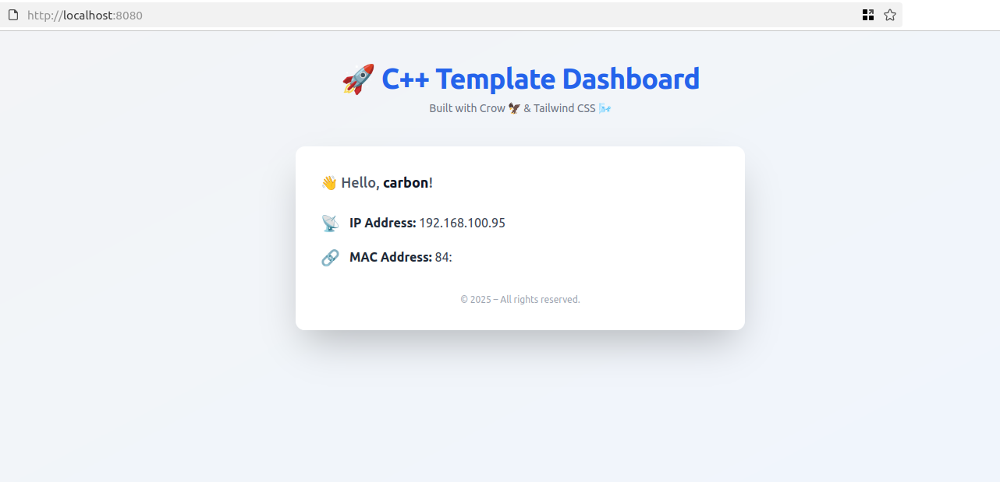

## CPP Conan Template



### Getting Started

build and run

```
./scripts/run.sh
# or
./scripts/run.sh --debug
# or 
./scripts/run.sh --release
```

build only

```
./scripts/build.sh
./scripts/build.sh --debug 
./scripts/build.sh --release
```

### Adding dependencies

To add a dependency,
First add it to  `cmake/Dependencies.cmake`. Make sure to add the
appropriate `find_package()` and set the variable under `PROJECR_LIBS`
so that it is available to the binary and  tests

Secondly, to include and install the actual dependencies,
include them in the `conanfile.txt`. to add additional dependencies
you may visit the [Conan Center](https://conan.io/center)

### Testing

This templates uses catch2 and ctest as the runner

To run tests

```
./scripts/run-test.sh
```

### Docker

```
docker build -t <your tag>
docker run -it <your tag>
```
